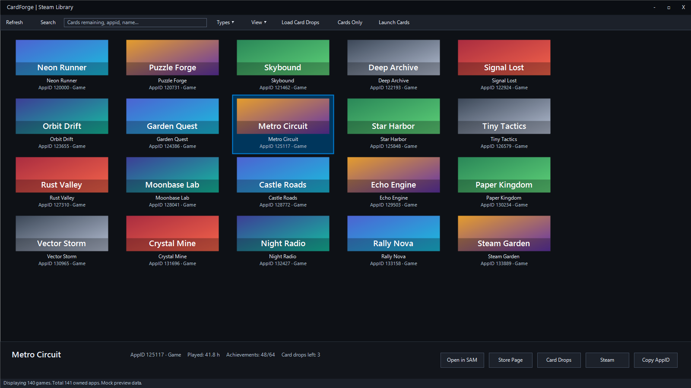
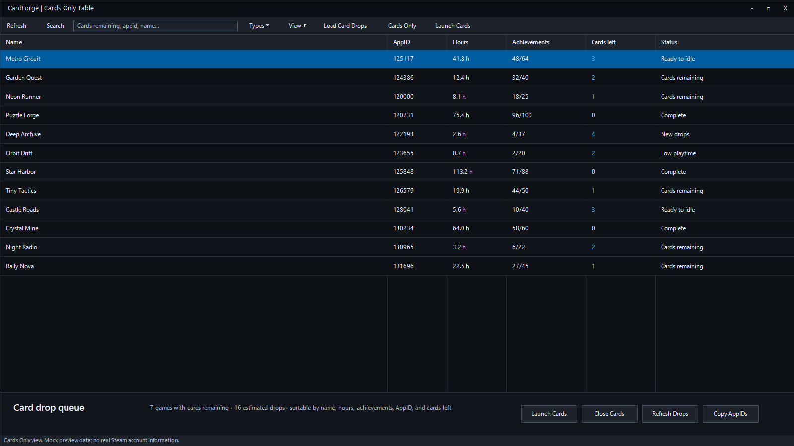

# CardForge

CardForge is an altered fork of Rick "gibbed" Gibbed's
[Steam Achievement Manager](https://github.com/gibbed/SteamAchievementManager).
It keeps the original SAM workflow available, but rebuilds the picker around a
more practical Steam library interface with playtime, achievement, and card-drop
helpers.

The goal is simple: keep SAM lightweight and portable, while making day-to-day
library management less awkward. CardForge adds a darker interface, faster image
loading, searchable views, card-drop scanning, and tray controls for opened game
windows.

CardForge is not affiliated with Valve, Steam, or the original SAM author. It is
an altered source version and preserves the original zlib license notice.

## Preview

The screenshots below use mock library data. They do not show a real Steam
account, cookies, session data, or a personal game library.





## Highlights

- Modern dark CardForge styling for both the picker and game manager windows.
- Larger Steam library picker with a wider search box.
- Search by game name, AppID, app type, Steam store URL, or `steam://run/` URL.
- Tiles, list, and sortable table library modes.
- Game Hub panel with quick actions for SAM, store pages, card pages, Steam
  pages, and AppID copying.
- Local playtime display from Steam's local user cache when available.
- Local achievement total display from Steam's cached stats schema when
  available.
- Embedded Steam badge scanner for remaining card drops.
- Cards Only filter for games with remaining card drops.
- Bulk launch and close helpers for games that still have card drops.
- Tray menu for hiding CardForge, refreshing data, and managing opened game
  windows.
- Cached Steam capsule images for faster startup after the first load.

## Card Drops

CardForge can open an embedded Steam badge viewer and scan the visible badge
pages for remaining card drops. This keeps the scan tied to the Steam account
that is currently signed in inside the embedded viewer.

The scanner is intentionally local and user-driven:

- it reads Steam community badge pages that the signed-in user can already see;
- it stores browser state only in the local WebView2 profile;
- WebView2 profile folders are ignored by Git and are not included in releases;
- the release archive does not include cookies, local storage, sessions, or
  account-specific cache.

## Current Status

CardForge is a preview fork. The main workflow works, but there are still UI
rough edges and unfinished areas. Known areas that need more polish:

- list mode layout;
- better filtering before scanning card pages;
- a cleaner single-window/tabbed manager for many opened SAM.Game windows;
- more complete metadata refresh behavior.

## Download

Use the latest preview release from this repository:

[Download CardForge preview](https://github.com/ManeWreck/CardForge/releases/latest)

The release archive is portable. Extract it anywhere and run `SAM.Picker.exe`.
Steam must be running, and you must be logged in to Steam.

## Build

Requirements:

- Windows;
- Steam client installed;
- .NET SDK with .NET Framework 4.8 targeting support;
- WebView2 Runtime for the embedded Steam badge viewer.

Build x86:

```powershell
dotnet build SAM.sln -p:Platform=x86
```

Build release package output:

```powershell
dotnet build SAM.sln -c Release -p:Platform=x86
```

Debug output is written to `bin/`. Release output is written to `upload/`.

## Privacy Notes

Do not commit or publish runtime state. The repository ignores these files by
default:

- `bin/`;
- `upload/`;
- `obj/`;
- `*.WebView2/`;
- `EBWebView/`;
- generated `CardForge-*.zip` archives.

Before publishing a release, delete any local WebView2 profile folders created
while signing in to Steam through the embedded viewer.

## Original Project

The original Steam Achievement Manager code was released by Rick Gibbed and is
available at [gibbed/SteamAchievementManager](https://github.com/gibbed/SteamAchievementManager).

The closed-source version originally released in 2008, had its last major
release in 2011, and received a hotfix in 2013. The open-source SAM 7.0.x code
included general maintenance, Fugue icon replacements, and version updates.

## Attribution

Most original SAM icons are from the
[Fugue Icons](https://p.yusukekamiyamane.com/) set.

CardForge-specific changes are maintained in this fork. The original license
notice remains in [LICENSE.txt](LICENSE.txt).
